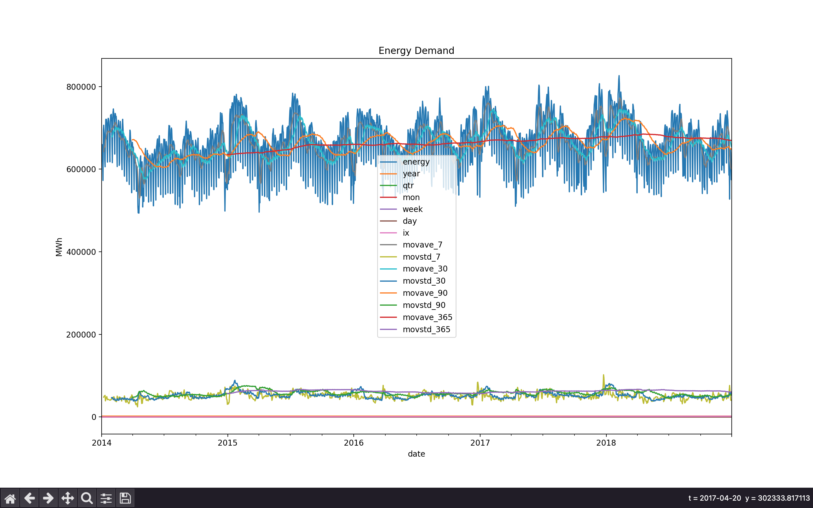

# Electric_Consumption_ML
Sure! Here's a detailed explanation of each module without the code to help you understand their functionality:

### 1. Data Processing (`Data_processing.py`)

**Purpose:** 
This module is responsible for loading the dataset and preprocessing it.

**Key Functions:**
- **load_and_preprocess_data**: Reads the data from a CSV file, filters the relevant columns, creates new time-based columns, sets the date as the index, and handles missing values. This function prepares the dataset for further analysis and modeling.

### 2. Exploratory Data Analysis (EDA) (`EDA.py`)

**Purpose:** 
This module performs exploratory data analysis to understand the dataset's structure, distribution, and key statistics.

**Key Functions:**
- **plot_energy_demand**: Plots the daily energy demand to visualize the data trend.
- **calculate_statistics**: Calculates basic statistics like mean, standard deviation, skewness, and kurtosis of the energy demand data.
- **plot_distribution**: Plots the distribution of the energy demand data and highlights key statistical values.
- **shapiro_test**: Conducts a Shapiro-Wilk test to check if the energy demand data follows a normal distribution.

### 3. Feature Engineering (`Feature_Eng.py`)

**Purpose:** 
This module creates new features from the existing data to improve the performance of predictive models.

**Key Functions:**
- **feature_engineering**: Creates lag features, moving averages, moving standard deviations, and other statistical features based on the energy demand data. It also generates dummy variables for months and weekdays to capture seasonal patterns. The function returns the enhanced dataset along with lists of feature and target columns.

### 4. Model Training (`Model_Training.py`)

**Purpose:** 
This module handles the training of different predictive models using the engineered features.

**Key Functions:**
- **train_linear_regression**: Trains a linear regression model on the training data and evaluates its performance on the test data.
- **train_random_forest**: Trains a Random Forest model, uses a time-series split for hyperparameter tuning, and evaluates its performance. This function also plots feature importance and returns predictions for both training and test data.

### 5. Model Evaluation (`Model_eval.py`)

**Purpose:** 
This module evaluates the performance of the trained models and visualizes the results.

**Key Functions:**
- **evaluate_model**: Calculates and prints key performance metrics such as Root Mean Squared Error (RMSE), Mean Absolute Percentage Error (MAPE), and Mean Absolute Error (MAE). It also plots the actual vs. predicted values.
- **plot_residual_analysis**: Plots histograms and time series of residuals to analyze the prediction errors.
- **plot_forecasting_results**: Creates scatter plots to compare actual vs. predicted values for both training and test datasets.

### Main Script (`main.py`)

**Purpose:** 
This script orchestrates the entire workflow by calling functions from the different modules in a logical sequence.

**Key Steps:**
1. **Data Processing**: Loads and preprocesses the data using the `load_and_preprocess_data` function from `Data_processing.py`.
2. **EDA**: Conducts exploratory data analysis using functions from `EDA.py` to understand the dataset.
3. **Feature Engineering**: Generates new features using the `feature_engineering` function from `Feature_Eng.py`.
4. **Train/Test Split**: Splits the data into training and test sets.
5. **Model Training and Evaluation**: Trains and evaluates both Linear Regression and Random Forest models using functions from `Model_Train.py` and `Model_eval.py`.
6. **Additional Analysis**: Performs residual analysis and visualizes forecasting results.

By structuring the code into these modules, each task is encapsulated within its own module, making the code more organized, maintainable, and easier to understand.

### Output:

